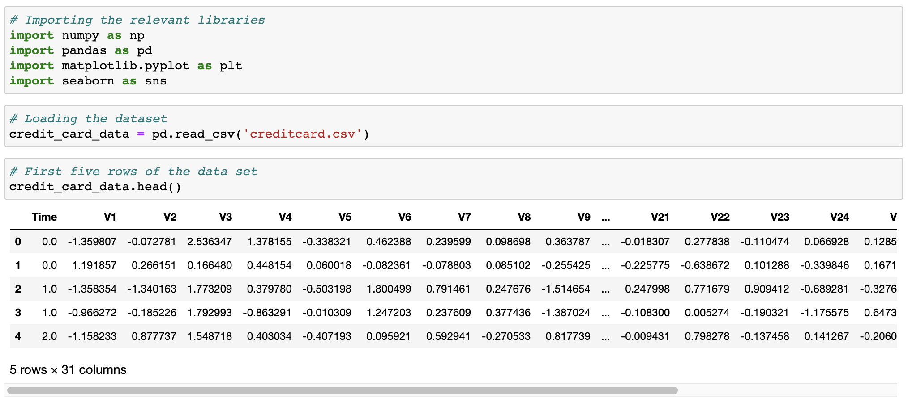
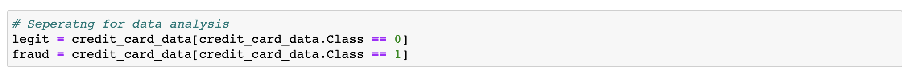
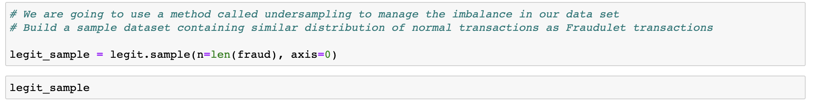

# Credit Card Fraud Detection

# Background

Credit card fraud is a major issue in today's society, costing billions of dollars annually. Fraudulent transactions can be difficult to detect, as they often involve small amounts of money and can be disguised as legitimate purchases. Machine learning offers a solution to this problem, by enabling algorithms to learn from patterns in data and identify suspicious transactions in real-time. In this project, we will explore the use of machine learning for credit card fraud detection, using a dataset of credit card transactions to build a model that can accurately identify fraudulent transactions and help reduce financial losses for both individuals and businesses.

# Obtaining the data

### Where did the data come from ?

The data was collected from Kaggle and contains transactions made by credit cards in September 2013 by European cardholders. This dataset presents transactions that occurred in two days, where we have 492 frauds out of 284,807 transactions. The dataset is highly unbalanced, the positive class (frauds) account for 0.172% of all transactions.

### Importing relevant libraries and loading data

# Data Preprocessing and Feature Engineering

### Dealing with Imbalance

In logistic regression, this refers to a situation where the distribution of the outcome variable (i.e., the binary response variable) is not balanced, meaning that one class has a much larger amount of observations than the other. We see this in our dataset wherby the amount of fraudulent cases is only 492 out of a total of 284,807 transactions. Class imbalance can be problematic in logistic regression because the algorithm tends to favor the majority class and may not perform well in predicting the minority class. This is because the logistic regression model is designed to minimize the overall error rate, which may result in a high accuracy for the majority class, but poor performance for the minority class.

To address the issue of imbalance in our dataset we are going to use a method could undersampling. Undersampling is a technique used in machine learning to address the problem of class imbalance in datasets. It involves reducing the number of observations in the majority class so that it is more balanced with the number of observations in the minority class. In our case a new data set was created containing equal distributions of fruadulent and legit transactions to improve the performance of the machine learning model.

